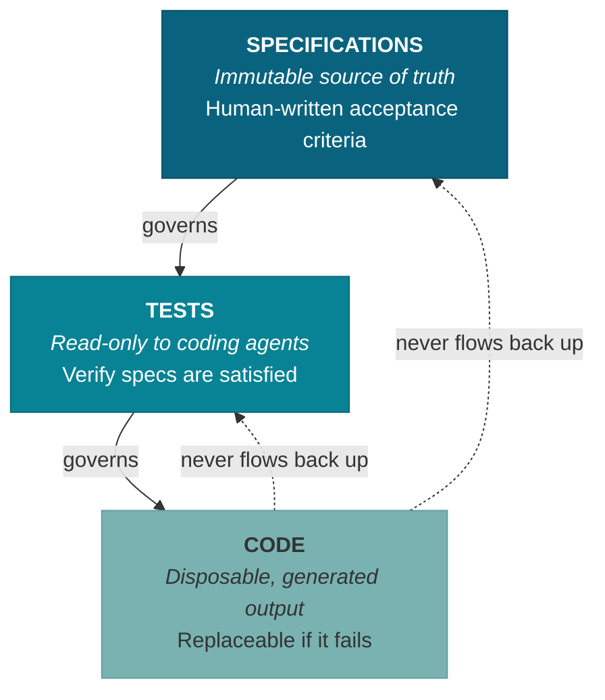
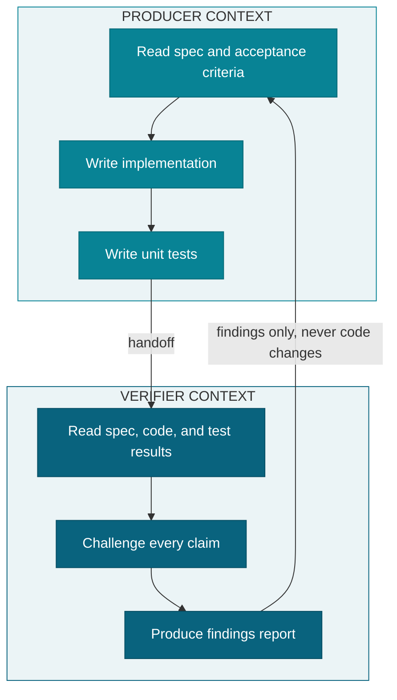
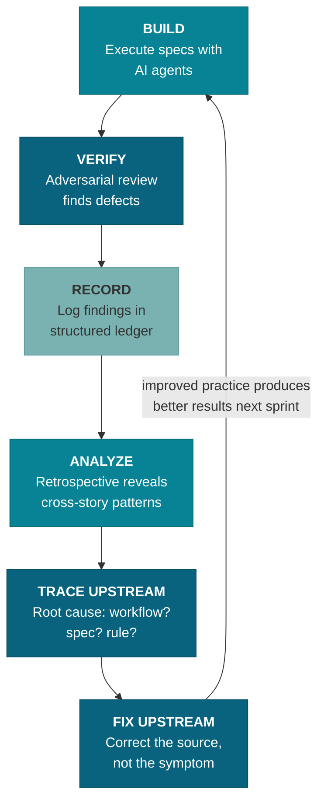
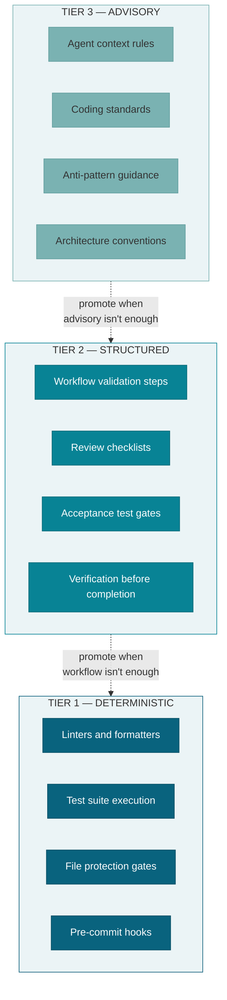
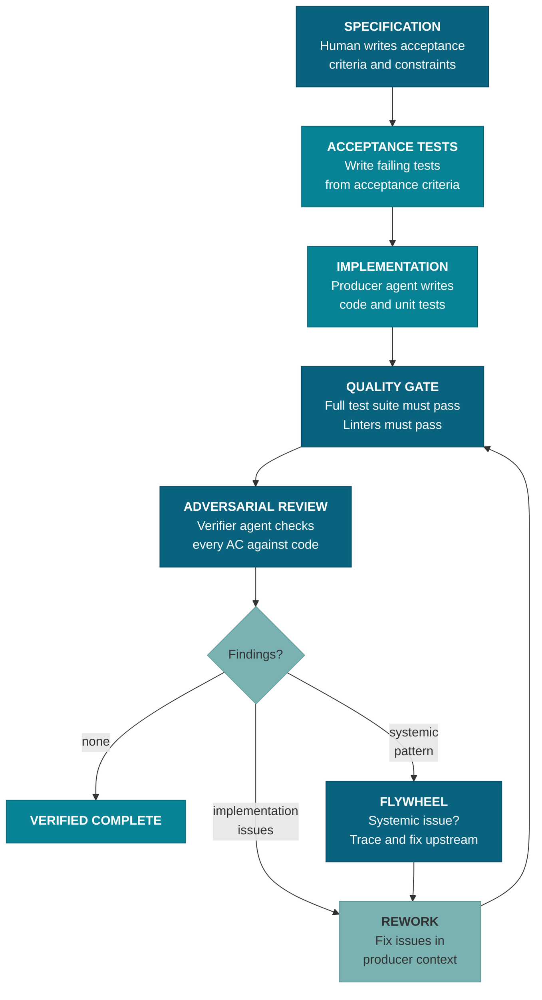

# Momentum

**A practice framework for agentic engineering.**

Momentum is a philosophy and process for building software with AI agents as primary code producers. It defines how specifications govern code generation, how quality is enforced when AI writes the code, and how the practice itself improves over time. The principles apply whether you're a solo developer or a team — anyone directing AI agents to produce code faces the same quality challenges.

Momentum is currently implemented using [BMAD Method](https://github.com/bmadcode/BMAD-METHOD) and [Claude Code](https://docs.anthropic.com/en/docs/claude-code), but the principles and process are tool-agnostic. Any agentic coding tool and workflow framework could serve as the implementation layer.

---

## Philosophy

### Spec-Driven Development

Specifications are the primary engineering artifact. Human-written acceptance criteria define correctness. Code is a generated, verified output — disposable and replaceable. The spec is what matters.

### Authority Hierarchy

**Specifications > Tests > Code.** Agents never modify specifications or pre-existing tests to make code pass. If a test fails, the code is wrong. If a spec is ambiguous, the agent asks — it doesn't assume. This hierarchy is encoded into machine-readable `derives_from` chains in document frontmatter, enforced by tooling — not just a guideline, but navigable infrastructure.

### Producer-Verifier Separation

The agent that writes code does not review it. Verification happens in a separate context with a separate agent whose only job is to find problems. Verifiers produce findings — they never modify code.

### Evaluation Flywheel

When output fails quality standards, trace the failure upstream via navigable `derives_from` chains. Don't just fix the code — fix the workflow, specification, or rule that caused the defect. Every upstream fix prevents a class of errors permanently. Each sprint's learnings compound into the next, building continuous improvement momentum.

### Three Tiers of Enforcement

Quality standards are enforced at three levels, from most to least reliable:

1. **Deterministic** — Automated gates that always execute: linters, test suites, file protection, pre-commit hooks. These cannot be ignored or deprioritized.
2. **Structured** — Workflow steps that enforce standards during execution: review checklists, validation gates, required verification before completion.
3. **Advisory** — Rules and guidelines loaded into agent context. Always available but may be deprioritized under context pressure. When possible, promote advisory standards to a higher tier.

### Cost as a Managed Dimension

Model selection, effort levels, and retry loop economics are engineering decisions, not afterthoughts. The **cognitive hazard rule:** for outputs without automated validation, use flagship models — invisible errors from cheaper models cost more than the price premium. Effort levels control thinking depth and therefore cost; every skill and agent specifies `model:` and `effort:` frontmatter explicitly.

### Provenance as Infrastructure

Every specification claim traces to a source. Every artifact tracks what it derives from (`derives_from` frontmatter) and what depends on it (auto-generated `referenced_by`). Ungrounded claims are marked, not assumed valid. When upstream documents change, downstream documents are flagged as suspect. This is not documentation hygiene — it is load-bearing infrastructure that enables the flywheel, prevents hallucination propagation, and stops obsolete decisions from resurfacing.

### Protocol-Based Integration

Every integration point in the practice is a configurable protocol. The project configures which implementation satisfies each protocol — which agent performs a role, which tool runs tests, which LLM provides research, which document structure constitutes the spec tree. Implementations can be substituted across teams, tools, and environments without modifying the workflows that depend on them. This is dependency inversion applied to the practice layer.

### Impermanence Principle

Processes and tooling that grow and improve are better than those that stay unchanged. Research has a short half-life in fast-moving domains. Decisions must be revisited, tools must be re-evaluated, and the practice itself must evolve. The anti-pattern is not change — it's unmanaged change.

---

## Quality Model

### Four AI-Induced Debt Types

Momentum's quality rules are organized around four categories of debt that AI code generation amplifies:

- **Verification Debt** — Unreviewed or inadequately tested AI-generated output accumulates faster than human-written code because generation is cheap. Layered verification (acceptance tests, unit tests, adversarial review, human review) counteracts this.
- **Cognitive Debt** — Code the developer cannot explain is a liability. If generated code can't be clearly explained, it gets rewritten. Understanding is not optional.
- **Pattern Drift** — AI amplifies whatever patterns it sees. If the codebase has anti-patterns, the AI will replicate them at scale. Architectural standards and explicit rules counteract this.
- **Technical Debt** — Compounds exponentially with AI-generated code because the volume is higher and the feedback loop is weaker. Adversarial review and refactoring discipline counteract this.

### Anti-Pattern Awareness

Momentum includes corrective rules targeting seven known AI code generation anti-patterns (based on [Ox Security research](https://www.ox.security/the-7-deadly-sins-of-ai-generated-code/)): excessive comments, textbook fixation, refactoring avoidance, over-specification, code duplication, monolithic tendencies, and dependency ignorance. Each rule prescribes the correct behavior rather than describing the problem.

---

## Process

### Development Flow

The full lifecycle of a unit of work — from specification through verified completion:

### Process Task Backlog

Practice improvements run concurrently with product work, not instead of it. A dedicated process backlog tracks infrastructure tasks at three priority levels:

- **Critical** — Cannot continue product work without these.
- **High** — Resolve during the current sprint, between stories.
- **Low** — Batch at sprint boundaries or defer to future sprints.

Process tasks flow through the same spec-driven workflow as product stories: write a spec, execute it, verify the result.

### Continuous Improvement Cycle

The practice improves through a structured cycle:

1. **Build** — Execute stories and process tasks using spec-driven development.
2. **Verify** — Adversarial review catches defects and anti-patterns.
3. **Record** — Quality findings are logged in a structured ledger.
4. **Analyze** — Retrospectives identify cross-story patterns in findings.
5. **Trace upstream** — Each pattern is traced to its root cause (workflow gap, spec ambiguity, missing rule).
6. **Fix upstream** — The root cause is corrected, preventing the entire class of defects permanently.
7. **Repeat** — The improved practice produces better results next sprint.

---

## Reference Documents

### The Practice Plan

The comprehensive plan defining Momentum's philosophy, process, and implementation roadmap:

- [Solo Agentic Engineering: Process, Philosophy, and Implementation Plan](docs/planning-artifacts/AI-Solo-Dev-Workflow-Plan-2026-03-07-final.md)

### Research Foundation

The research that informed the practice design:

**Core Research**
- [Consolidated Agentic Engineering Research](docs/research/AI-Solo-Dev-Consolidated-Research-2026-03-07-final.md) — the primary research synthesis that grounds the practice plan
- [Solo Dev Workflow Optimization](docs/research/AI%20Solo%20Dev%20Workflow%20Optimization%20Report.md) — patterns for effective solo AI-assisted development
- [AI Engineering Maturity and Adoption](docs/research/AI%20Engineering%20Maturity%20and%20Adoption.md) — industry maturity models and adoption patterns

**Technical Architecture**
- [Agentic Architecture: BMAD vs Claude Code Native](docs/research/technical-agentic-architecture-bmad-vs-claude-code-2026-03-07.md) — tradeoffs between framework-managed and native agent patterns
- [Claude Code Tool Permissions](docs/research/technical-claude-code-tool-permissions-research-2026-03-07.md) — permission model for agent tool access
- [Subagent Permissions Reference](docs/research/technical-subagent-permissions-reference-2026-03-07.md) — schema for sub-agent capability constraints

---

## Project Structure

- `docs/` — Planning artifacts, research, process backlog, implementation specs
- `module/` — Canonical practice files (rules, agents, templates)

## Status

Momentum is in early development. The philosophy and process are defined. Implementation of the core practice layer (quality rules, verification agents, install workflow) is in progress.

## License

Apache License 2.0 — see [LICENSE](LICENSE)
