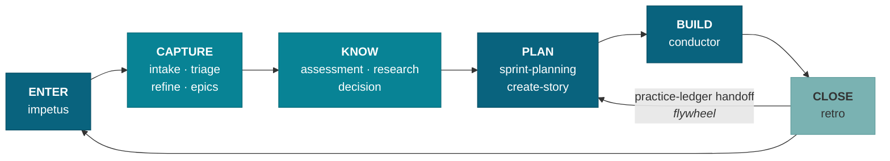
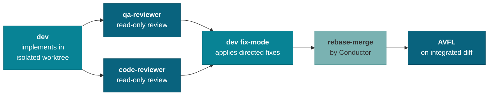

<p align="center">
  <picture>
    <source media="(prefers-color-scheme: dark)" srcset="docs/assets/readme/hero-dark.svg">
    
  </picture>
</p>

<p align="center"><b>A practice framework for agentic engineering — specs govern the code, producers never verify their own output, and the practice improves itself every cycle.</b></p>

Momentum is a philosophy and process for building software with AI agents as primary code producers. It defines how specifications govern code generation, how quality is enforced when agents write the code, and how the practice itself improves with each sprint. It is implemented as Claude Code skills atop [BMAD Method](https://github.com/bmadcode/BMAD-METHOD), but the principles are tool-agnostic — any agentic coding tool could serve as the implementation layer. Whether you are a solo developer or a team, directing AI agents to produce code raises the same quality problems, and Momentum is a complete, running answer to them.

**[Explore the interactive cycle →](https://iamsteveholmes.github.io/momentum/)**

---

## Quick Start

```bash
npx skills add https://github.com/iamsteveholmes/momentum --all
```

Then, in Claude Code:

```
/momentum
```

Impetus — the Momentum orchestrator — runs first-time setup (rules, hooks, MCP integrations) and orients you to the available workflows.

Momentum operates at three enforcement tiers. The same skill files install everywhere; what changes is how much is enforced for you:

- **Tier 1 — Full deterministic (Claude Code).** Hooks fire automatically on file changes, rules auto-load into every session, verification agents run in isolated contexts, and `/momentum` provides session orientation. Deterministic gates cannot be skipped or forgotten.
- **Tier 2 — Advisory (Cursor and other Agent Skills tools).** `npx skills add https://github.com/iamsteveholmes/momentum -a cursor`. Skill workflows, checklists, and quality guidance all function as advisory instructions; Claude Code-specific frontmatter is silently ignored. No hooks, no subagent isolation, no orchestrator.
- **Tier 3 — Philosophy only (no tooling).** Read the [principles](#principles) and [docs/philosophy.md](docs/philosophy.md), and apply spec-driven development, the authority hierarchy, and producer-verifier separation by hand. No installation needed.

---

## The Cycle

Momentum organizes the practice as a six-phase loop. Each phase is a set of skills; the close of one sprint feeds the planning of the next.



### 1 · Enter

Every session starts at `/momentum`. Impetus reads the landscape — sprint state, story status, outstanding signals — and orients you before offering a path forward. It presents a state ledger and a workflow menu, then dispatches to the right skill. It never acts without consent; its power is knowing which skill to summon and when.

| Command | What it does |
|---|---|
| `/momentum` | Session orientation, sprint intelligence, and workflow dispatch |

### 2 · Capture

Ideas arrive mid-conversation; Capture keeps them from evaporating. `intake` preserves a story idea as a backlog stub in seconds. `triage` runs observations through a dedup gate and classifies them into five classes (ARTIFACT / DECISION / SHAPING / DEFER / REJECT), routing each to the right destination. `refine` keeps the backlog honest, and the epic skills keep the taxonomy coherent — `epic-grooming` is the sole writer of `epics.json`.

| Command | What it does |
|---|---|
| `/momentum:intake` | Capture a story idea from conversation as a backlog stub |
| `/momentum:triage` | Dedup gate + batch-classify observations into five classes, then route |
| `/momentum:refine` | Backlog hygiene — drift detection, status mismatches, stale-story triage |
| `/momentum:epic-grooming` | Epic taxonomy, value analysis, orphan resolution, `epics.json` maintenance |
| `/momentum:epic-breakdown` | Enumerate the missing stories needed to ship an epic |

### 3 · Know

Before planning, establish what is true. `assessment` spawns parallel discovery agents and validates every finding with the developer before writing an ASR document. `research` runs a six-phase pipeline (SCOPE → EXECUTE → VERIFY → Q&A → SYNTHESIZE → COMMIT) with Gemini CLI triangulation and AVFL corpus validation. `decision` walks the findings and records adopt/reject/defer outcomes as SDR documents with provenance chains back to their sources.

| Command | What it does |
|---|---|
| `/momentum:assessment` | Parallel discovery agents → developer-validated ASR document |
| `/momentum:research` | Deep research pipeline with triangulation, AVFL validation, provenance |
| `/momentum:decision` | Record adopt/reject/defer decisions as linked SDR documents |

### 4 · Plan

`sprint-planning` reads the backlog — including handoff events the last retro wrote to the practice ledger — selects stories, fleshes them via `create-story` (change-type classification, injected EDD/TDD guidance, AVFL validation), writes Gherkin specs, composes the team, and activates the sprint. At activation, verification contracts are frozen into `.momentum/sprints/{sprint}/specs/`. All index writes go through `sprint-manager`, the sole writer of the story and sprint registries.

| Command | What it does |
|---|---|
| `/momentum:sprint-planning` | Story selection, team composition, Gherkin specs, activation |
| `/momentum:create-story` | Story creation with change-type classification and AVFL validation |
| `sprint-manager` <sub>(spawned)</sub> | Sole writer of `stories/index.json` and `sprints/index.json` |
| `plan-audit` <sub>(runs before plan mode exits)</sub> | Audits plans for spec impact, classifies trivial vs. substantive |

### 5 · Build

`/momentum:conduct` runs the build end to end — pre-flight through a single human end-gate, with no story-count cap. The Conductor orchestrates per-story pipelines on an event-driven dependency frontier, never writes code itself, and holds sole git-mutation authority. After stories merge, AVFL validates the integrated diff, E2E validation runs through the verification harness, and the build proceeds silently to the end-gate. Mid-flight escalation exists only for findings that are irreversible-and-imminent or build-invalidating. For a single story, `quick-fix` is the streamlined alternative: define, specify, implement, validate, and merge in one flow.

| Command | What it does |
|---|---|
| `/momentum:conduct` | Sprint build orchestrator — per-story pipelines, AVFL-on-merge, E2E, end-gate |
| `/momentum:quick-fix` | Single-story define → specify → implement → validate → merge |
| `sprint-dev` <sub>(spawned)</sub> | Dependency-driven story development with post-merge AVFL |
| `dev` <sub>(spawned)</sub> | Pure implementer — delegates to bmad-dev-story, emits completion signal |

### 6 · Close

`retro` extracts and audits the sprint's transcripts in one dynamic workflow (Discover → Verify → Synthesize), verifies stories against what actually shipped, and turns findings into backlog stubs. Findings that are not actioned are written to `practice-ledger.jsonl` as handoff events — which the next `sprint-planning` reads in its first step. That edge is the flywheel: every sprint's lessons are structurally guaranteed to reach the next sprint's plan.

| Command | What it does |
|---|---|
| `/momentum:retro` | Transcript audit, story verification, findings document, sprint closure |

---

## Quality Machinery

Producer-verifier separation is implemented, not aspirational: writers never verify, verifiers never write. In the per-story pipeline, `dev` implements in an isolated worktree, then `qa-reviewer` and `code-reviewer` examine the diff concurrently and read-only. Their findings come back as a directed fix list that `dev` applies in fix-mode; the Conductor — never a subagent — performs the rebase-merge.



After merge, the **Adversarial Validate-Fix Loop (AVFL)** runs its five-worker fleet — `validator-enum`, `validator-adv`, `consolidator`, `fixer`, `merge-review` — over the integrated sprint diff, iterating to convergence. E2E behavioral validation then routes each story by change type through `verification-harness.json` drivers (skill-invoke, bash, curl, Maestro, document-review).

Every finding carries a canonical schema with a `stakes_class` — `security-auth-isolation`, `irreversible-destructive`, `high-blast-radius-architecture`, or `routine` — and disposition follows fixed rules:

| Finding | Disposition |
|---|---|
| Legitimate + routine | Auto-fix silently; collapsed to counts at the end-gate |
| Legitimate + stakes-class | Escalate — decision card at the end-gate; mid-flight only if irreversible-and-imminent or build-invalidating |
| Non-legitimate | Dismiss with recorded rationale |
| Out of scope | Route to triage |

The build ends at a **single human end-gate**: stakes-class findings presented as decision cards, routine work collapsed to counts, one approval, then merge to main.

---

## Deterministic Enforcement

Three hooks make the non-negotiable parts non-negotiable:

| Hook | Event | What it does |
|---|---|---|
| `file-protection.sh` | PreToolUse | Blocks writes to protected paths before they happen |
| `lint-format.sh` | PostToolUse | Lints and formats every edited file automatically |
| `stop-gate.sh` | Stop | Quality gate before an agent may finish its turn |

Protected paths (`.claude/momentum/protected-paths.json`) cover acceptance tests, project rules, planning artifacts, frozen sprint specs, and the index files. Sole-writer rules are enforced the same way: `sprint-manager` is the only writer of `stories/index.json` and `sprints/index.json`, and `epic-grooming` is the only writer of `epics.json`.

---

## Skill Catalog

27 skills ship in `skills/momentum/` (plus an internal workspace helper for constitution-builder). Grouped by phase:

<details>
<summary><b>Enter</b> — 1 skill</summary>

| Command | Description |
|---|---|
| `/momentum` | Impetus — session orientation, sprint intelligence, and workflow dispatch |

</details>

<details>
<summary><b>Capture</b> — 5 skills</summary>

| Command | Description |
|---|---|
| `/momentum:intake` | Capture a story idea from conversation into the backlog as a stub |
| `/momentum:triage` | Dedup gate + batch-classify observations into five classes, enrich ARTIFACTs, delegate or queue |
| `/momentum:refine` | Backlog hygiene — drift detection, status mismatches, stale-story triage, batch approval |
| `/momentum:epic-grooming` | Unified epic taxonomy, value analysis, orphan resolution, `epics.json` maintenance |
| `/momentum:epic-breakdown` | Enumerate missing stories for an epic end to end |

</details>

<details>
<summary><b>Know</b> — 3 skills</summary>

| Command | Description |
|---|---|
| `/momentum:assessment` | Guided product state evaluation — parallel discovery, developer validation, ASR document |
| `/momentum:research` | Deep research pipeline with parallel subagents, Gemini triangulation, AVFL corpus validation |
| `/momentum:decision` | Capture strategic decisions — walk findings, record adopt/reject/defer, write a linked SDR |

</details>

<details>
<summary><b>Plan</b> — 4 skills</summary>

| Command | Description |
|---|---|
| `/momentum:sprint-planning` | Story selection, team composition, Gherkin specs, and activation |
| `/momentum:create-story` | Story creation with change-type classification, EDD/TDD guidance, AVFL validation |
| `sprint-manager` <sub>(spawned by sprint-planning)</sub> | Sole writer of `stories/index.json` and `sprints/index.json`; validates state transitions, activates sprints |
| `plan-audit` <sub>(runs before plan mode exits)</sub> | Audits the active plan for spec impact and writes a Spec Impact section |

</details>

<details>
<summary><b>Build</b> — 4 skills</summary>

| Command | Description |
|---|---|
| `/momentum:conduct` | In-session sprint build orchestrator — per-story pipelines, AVFL-on-merge, E2E, single end-gate |
| `/momentum:quick-fix` | Single-story fix — define, specify, implement, validate, and merge in one streamlined flow |
| `sprint-dev` <sub>(spawned by conductor)</sub> | Dependency-driven story development, post-merge AVFL, team review |
| `dev` <sub>(spawned by conductor)</sub> | Pure implementer — delegates to bmad-dev-story, emits implementation-complete signal |

</details>

<details>
<summary><b>Close</b> — 1 skill</summary>

| Command | Description |
|---|---|
| `/momentum:retro` | Transcript audit engine, story verification, findings document, sprint closure |

</details>

<details>
<summary><b>Quality</b> — 4 skills</summary>

| Command | Description |
|---|---|
| `avfl` <sub>(spawned for AVFL-on-merge; user-invocable standalone)</sub> | Adversarial Validate-Fix Loop — parallel validation lenses with iterative fix |
| `code-reviewer` <sub>(spawned by conductor)</sub> | bmad-code-review adapter — adversarial bug-hunt in report-only mode, findings normalized with `stakes_class` |
| `architecture-guard` <sub>(invoked by impetus — not directly)</sub> | Detects pattern drift against architecture decisions; read-only enforcer |
| `/momentum:upstream-fix` | Traces quality failures upstream to spec, rule, or workflow root cause |

</details>

<details>
<summary><b>Infrastructure</b> — 5 skills</summary>

| Command | Description |
|---|---|
| `/momentum:canvas` | Launch the Momentum Cycle live dashboard (Hono+Bun, port 3456) |
| `/momentum:agent-builder` | Tier 2 agent composer — base body + constitution + manifesto → composed agent |
| `/momentum:constitution-builder` | Builds the hot constitution (Permissions + Standing Rules + Quick Routing) for KB-backed agents |
| `/momentum:agent-guidelines` | Discovers project stack, researches breaking changes, generates path-scoped rules |
| `/momentum:feature-status` | Deprecated — outputs a pointer to `/momentum:canvas` and halts |

</details>

The `avfl` skill carries its own five-worker sub-skill fleet (`validator-enum`, `validator-adv`, `consolidator`, `fixer`, `merge-review`). No `bmad-*` skills are vendored in this repo — `dev` and `code-reviewer` delegate to BMAD Method skills installed alongside Momentum.

---

## Architecture

Momentum keeps its operational state in plain JSON and JSONL files in your project:

```
.momentum/
├── sprints/index.json            # sprint registry — sole writer: sprint-manager
├── stories/index.json            # story registry — sole writer: sprint-manager
├── practice-ledger.jsonl         # quality findings, triage outcomes, handoff events
└── sprints/{sprint}/
    ├── specs/                    # verification contracts, frozen at activation
    └── audit-extracts/           # retro transcript extractions (jsonl)
.claude/momentum/
├── protected-paths.json          # file-protection policy patterns
└── installed.json                # install state + version registry
momentum/
├── agents.json                   # agent routing table
└── verification-harness.json     # change_type → E2E driver routing
docs/
├── planning-artifacts/           # PRD, architecture decisions, epics
├── research/                     # research pipeline outputs
└── intake/                       # observations, backlog stubs
```

(`epics.json` currently lives at `_bmad-output/planning-artifacts/epics.json`, written solely by epic-grooming.)

- **momentum-tools** — a deterministic CLI (`skills/momentum/bin/momentum-tools`) for sprint, session, agent-routing, quickfix, practice-ledger, triage, and version operations. Skills shell out to it instead of hand-editing state.
- **canvas** — a live dashboard (Hono+Bun, port 3456) showing the cycle and sprint state.
- **Three-tier agent composition** — a hot constitution embedded in the skill (Permissions, Standing Rules, Quick Routing), a composed agent built by `agent-builder` from one of 9 base bodies plus constitution and manifesto, and a cold knowledge base reached via wiki-query.

---

## Principles

Full essays with diagrams live in [docs/philosophy.md](docs/philosophy.md).

1. **Spec-Driven Development** — Specifications are the primary artifact. Code is generated, verified output.
2. **Authority Hierarchy** — Specifications > Tests > Code. Never modify upstream artifacts to accommodate downstream failures.
3. **Producer-Verifier Separation** — The agent that writes code never reviews it. Verification happens in a separate context.
4. **Evaluation Flywheel** — Trace quality failures upstream. Fix the workflow, spec, or rule — not just the code.
5. **Three Tiers of Enforcement** — Deterministic, Structured, Advisory. Promote standards to higher tiers when possible.
6. **Cost as a Managed Dimension** — Model selection and effort levels are engineering decisions. Use flagship models for unvalidated outputs.
7. **Provenance as Infrastructure** — Every claim traces to a source. `derives_from` chains are navigable infrastructure, not documentation.
8. **Protocol-Based Integration** — Every integration point is a configurable protocol. Implementations are substitutable without modifying workflows.
9. **Impermanence Principle** — Processes that grow and improve beat those that stay unchanged. The anti-pattern is unmanaged change.
10. **Attention as a Finite Resource** — Review quality degrades under load. Design checkpoints for sustainability, not completeness.

---

## Project Structure

- `skills/momentum/` — the skill suite, agents, hooks, references, and the momentum-tools CLI
- `momentum/` — agent routing and verification-harness configuration
- `docs/` — philosophy, planning artifacts, research, implementation specs
- `module/` — canonical practice files (rules, agents, templates)

## Status

The practice layer exists and runs real sprints today: planning, conducted builds with AVFL and E2E validation, retrospectives, and the practice-ledger flywheel are all operational. Current version: **1.0.0** (see [version.md](version.md)).

## License

Apache License 2.0 — see [LICENSE](LICENSE)
