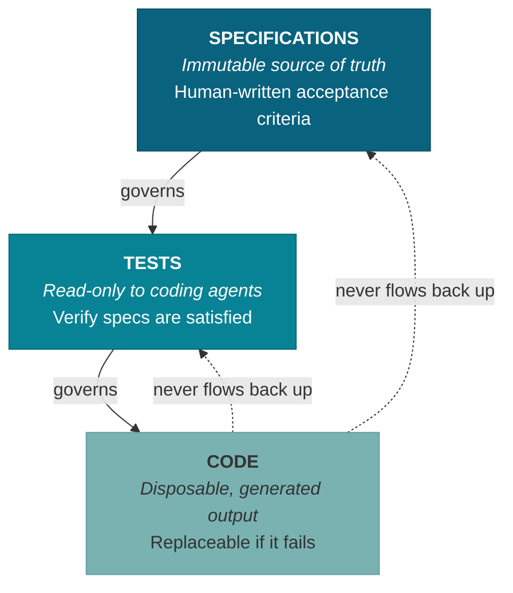
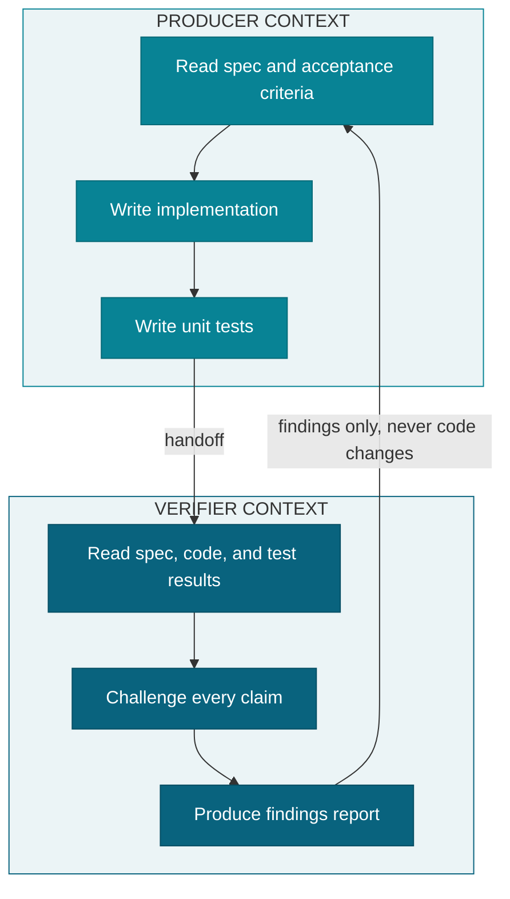
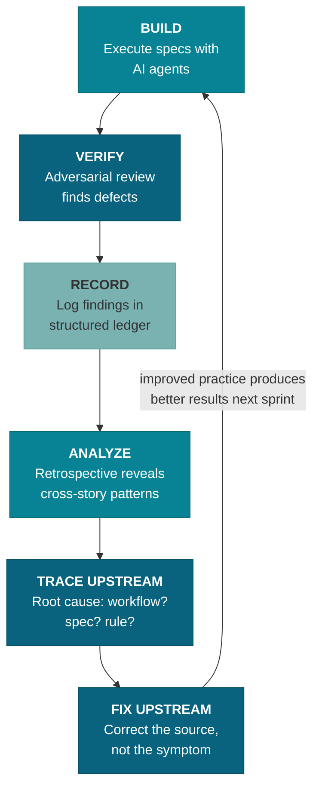
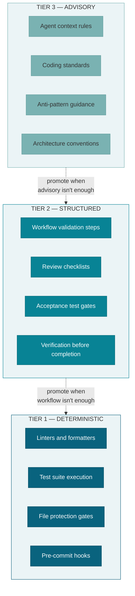
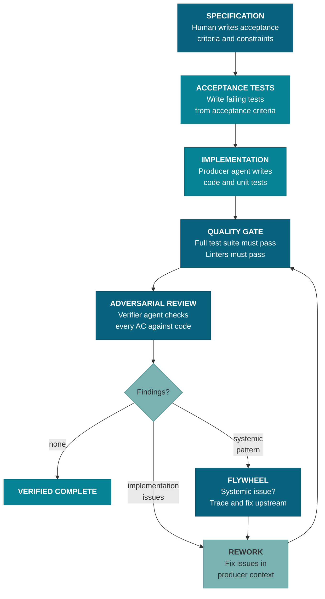

# Momentum

**A practice framework for agentic engineering.**

Momentum is a philosophy and process for building software with AI agents as primary code producers. It defines how specifications govern code generation, how quality is enforced when AI writes the code, and how the practice itself improves over time. The principles apply whether you're a solo developer or a team — anyone directing AI agents to produce code faces the same quality challenges.

Momentum is currently implemented using [BMAD Method](https://github.com/bmadcode/BMAD-METHOD) and [Claude Code](https://docs.anthropic.com/en/docs/claude-code), but the principles and process are tool-agnostic. Any agentic coding tool and workflow framework could serve as the implementation layer.

---

## Quick Start

**Claude Code (Tier 1 — full enforcement):**

```bash
npx @anthropic-ai/claude-code skills add momentum/momentum -a claude-code
```

Then in Claude Code:

```
/momentum
```

Impetus (the Momentum orchestrator) runs first-time setup: installs global rules, configures hooks, sets up MCP integrations, and orients you to available workflows.

**Cursor or other tools (Tier 2 — advisory):**

```bash
npx @anthropic-ai/claude-code skills add momentum/momentum -a cursor
```

Skills install and are invocable immediately. No additional setup required.

**No tooling (Tier 3 — philosophy only):**

Read the [Principles](#the-principles) section below and the [Philosophy](#philosophy) section for the full framework. No installation needed.

---

## Enforcement Tiers

Momentum operates at three tiers depending on your tool environment. The same skill files install at every tier — what changes is the enforcement level.

### Tier 1: Full Deterministic — Claude Code

Claude Code provides the complete enforcement stack:

- **Hooks** fire automatically on file changes — linting, formatting, and file protection run without developer action
- **Rules** auto-load into every session from `~/.claude/rules/` — authority hierarchy, anti-pattern rules, and coding standards are always in context
- **Subagent isolation** via `context: fork` — verification agents run in separate contexts with restricted tool access, enforcing producer-verifier separation
- **Model routing** — skills specify `model:` and `effort:` frontmatter; Claude Code routes to the appropriate model tier
- **Impetus orchestration** — `/momentum` provides session orientation, sprint awareness, install/upgrade management, and workflow access

**What "full deterministic" means:** Quality standards at the deterministic enforcement tier (hooks, test gates, file protection) execute automatically. They cannot be skipped, deprioritized, or forgotten. Structured enforcement (workflow steps, review checklists) executes as part of skill workflows. Advisory enforcement (rules in context) is always loaded.

**Install:** `npx @anthropic-ai/claude-code skills add momentum/momentum -a claude-code`, then `/momentum`

### Tier 2: Advisory — Cursor and Other Tools

Tools that support the [Agent Skills](https://github.com/anthropic-ai/skills) standard can install Momentum skills:

- **Skill instructions execute** — all SKILL.md files are available and functional
- **Guidance is advisory** — the tool provides instructions to the agent, but enforcement depends on the agent following them
- **Extra frontmatter is silently ignored** — `context: fork`, `model:`, `effort:`, and `allowed-tools` fields are Claude Code-specific; other tools skip them without error

**What is NOT available at Tier 2:**

- Hooks (no automatic linting, formatting, or file protection)
- Global rules (no `~/.claude/rules/` auto-loading)
- Subagent isolation (no `context: fork` — all work happens in a single context)
- Model routing (no `model:` frontmatter enforcement)
- Impetus orchestration (no `/momentum` session management)

Skills still provide significant value at Tier 2 — workflow structure, acceptance criteria enforcement, review checklists, and quality guidance all function as advisory instructions.

**Install:** `npx @anthropic-ai/claude-code skills add momentum/momentum -a cursor`

### Tier 3: Philosophy Only — No Tooling

Momentum's principles are designed to be valuable without any tooling. A developer or team can adopt the practice by reading the documentation:

1. **Read the principles** — The [Principles](#the-principles) section summarizes the core ideas. The [Philosophy](#philosophy) section provides full explanations with diagrams.
2. **Apply spec-driven development** — Write acceptance criteria before generating code. Review specifications, not just code.
3. **Enforce the authority hierarchy** — Specifications govern tests, tests govern code. Never modify specs to match generated output.
4. **Separate production from verification** — Don't review your own AI-generated code in the same context that produced it. Use a fresh session or a different tool.
5. **Trace failures upstream** — When output is wrong, ask whether the spec, the workflow, or the rule was the root cause. Fix the source, not the symptom.

No installation, no tooling dependency. The principles apply to any AI-assisted development workflow.

---

## The Principles

Momentum is built on these core principles. Each is explained in detail in the [Philosophy](#philosophy) section.

1. **Spec-Driven Development** — Specifications are the primary artifact. Code is generated, verified output.
2. **Authority Hierarchy** — Specifications > Tests > Code. Never modify upstream artifacts to accommodate downstream failures.
3. **Producer-Verifier Separation** — The agent that writes code never reviews it. Verification happens in a separate context.
4. **Evaluation Flywheel** — Trace quality failures upstream. Fix the workflow, spec, or rule — not just the code.
5. **Three Tiers of Enforcement** — Deterministic (automated gates), Structured (workflow steps), Advisory (context rules). Promote standards to higher tiers when possible.
6. **Cost as a Managed Dimension** — Model selection and effort levels are engineering decisions. Use flagship models for unvalidated outputs.
7. **Provenance as Infrastructure** — Every claim traces to a source. `derives_from` chains are navigable infrastructure, not documentation.
8. **Protocol-Based Integration** — Every integration point is a configurable protocol. Implementations are substitutable without modifying workflows.
9. **Impermanence Principle** — Processes that grow and improve beat those that stay unchanged. The anti-pattern is unmanaged change.
10. **Attention as a Finite Resource** — Review quality degrades under load. Design checkpoints for sustainability, not completeness.

---

## Philosophy

### Spec-Driven Development

Specifications are the primary engineering artifact. Human-written acceptance criteria define correctness. Code is a generated, verified output — disposable and replaceable. The spec is what matters. The practice is responsible for keeping specifications reviewable — a spec nobody can sustain attention through is no better than no spec at all.

### Authority Hierarchy

**Specifications > Tests > Code.** Agents never modify specifications or pre-existing tests to make code pass. If a test fails, the code is wrong. If a spec is ambiguous, the agent asks — it doesn't assume. This hierarchy is encoded into machine-readable `derives_from` chains in document frontmatter, enforced by tooling — not just a guideline, but navigable infrastructure.



### Producer-Verifier Separation

The agent that writes code does not review it. Verification happens in a separate context with a separate agent whose only job is to find problems. Verifiers produce findings — they never modify code.



### Evaluation Flywheel

When output fails quality standards, trace the failure upstream via navigable `derives_from` chains. Don't just fix the code — fix the workflow, specification, or rule that caused the defect. Every upstream fix prevents a class of errors permanently. Each sprint's learnings compound into the next, building continuous improvement momentum.



### Three Tiers of Enforcement

Quality standards are enforced at three levels, from most to least reliable:

1. **Deterministic** — Automated gates that always execute: linters, test suites, file protection, pre-commit hooks. These cannot be ignored or deprioritized.
2. **Structured** — Workflow steps that enforce standards during execution: review checklists, validation gates, required verification before completion.
3. **Advisory** — Rules and guidelines loaded into agent context. Always available but may be deprioritized under context pressure. When possible, promote advisory standards to a higher tier.



### Cost as a Managed Dimension

Model selection, effort levels, and retry loop economics are engineering decisions, not afterthoughts. The **cognitive hazard rule:** for outputs without automated validation, use flagship models — invisible errors from cheaper models cost more than the price premium. Effort levels control thinking depth and therefore cost; every skill and agent specifies `model:` and `effort:` frontmatter explicitly.

### Provenance as Infrastructure

Every specification claim traces to a source. Every artifact tracks what it derives from (`derives_from` frontmatter) and what depends on it (auto-generated `referenced_by`). Ungrounded claims are marked, not assumed valid. When upstream documents change, downstream documents are flagged as suspect. This is not documentation hygiene — it is load-bearing infrastructure that enables the flywheel, prevents hallucination propagation, and stops obsolete decisions from resurfacing.

### Protocol-Based Integration

Every integration point in the practice is a configurable protocol. The project configures which implementation satisfies each protocol — which agent performs a role, which tool runs tests, which LLM provides research, which document structure constitutes the spec tree. Implementations can be substituted across teams, tools, and environments without modifying the workflows that depend on them. This is dependency inversion applied to the practice layer.

### Impermanence Principle

Processes and tooling that grow and improve are better than those that stay unchanged. Research has a short half-life in fast-moving domains. Decisions must be revisited, tools must be re-evaluated, and the practice itself must evolve. The anti-pattern is not change — it's unmanaged change.

### Attention as a Finite Resource

The spec-driven methodology only works if humans review specifications with care. Attention is finite, degrades predictably under load, and cannot be replenished by willpower. Cognitive science establishes that vigilance decrement — the decline in detection accuracy during sustained monitoring — begins within 10-15 minutes under high-demand conditions. Spec fatigue, the progressive loss of review quality over time, is a natural consequence of generating more specification material than humans can sustainably review.

Every workflow, checkpoint, and review gate must be designed with the assumption that the reviewer's attention is a depletable resource, not an infinite constant. The 39-point perception gap between actual and perceived performance (METR, 2025) means developers cannot self-assess their own review degradation. The practice must enforce sustainability rather than relying on self-regulation.

Three design principles follow: (1) minimize what requires human review — automate verification where possible, (2) direct review effort where uncertainty is highest — not where volume is highest, and (3) respect cognitive recovery time between review demands — sequential approvals degrade in quality independent of content.

---

## Quality Model

### Five AI-Induced Debt Types

Momentum's quality rules are organized around five categories of debt that AI-augmented development amplifies:

- **Verification Debt** — Unreviewed or inadequately tested AI-generated output accumulates faster than human-written code because generation is cheap. Layered verification (acceptance tests, unit tests, adversarial review, human review) counteracts this.
- **Cognitive Debt** — Code the developer cannot explain is a liability. If generated code can't be clearly explained, it gets rewritten. Understanding is not optional.
- **Pattern Drift** — AI amplifies whatever patterns it sees. If the codebase has anti-patterns, the AI will replicate them at scale. Architectural standards and explicit rules counteract this.
- **Technical Debt** — Compounds exponentially with AI-generated code because the volume is higher and the feedback loop is weaker. Adversarial review and refactoring discipline counteract this.
- **Review Debt** — Specifications approved without genuine scrutiny. Spec-driven development amplifies this: the methodology generates review demands faster than humans can sustain quality attention. Unlike Cognitive Debt (can you explain it?), Review Debt is a stamina failure (did you actually check it?). Automation monitoring research shows a 55% omission rate, and the expertise reversal effect means experienced users are *more* susceptible, not less. Review Debt is invisible and self-reinforcing. Mitigations: attention-aware checkpoints, confidence-directed review that focuses scrutiny where uncertainty is highest, and expertise-adaptive guidance that fades as competence grows.

Left unaddressed, these debts interact and compound: verification debt feeds cognitive debt (unreviewed code you don't understand), cognitive debt enables pattern drift (you can't spot what you don't comprehend), pattern drift accelerates technical debt (bad patterns replicate at AI speed), and review debt feeds all of them — specifications approved without scrutiny become the authoritative source for downstream code generation, verification, and architectural decisions.

### Anti-Pattern Awareness

**Code Generation Anti-Patterns:** Momentum includes corrective rules targeting seven known AI code generation anti-patterns (based on [Ox Security research](https://www.ox.security/the-7-deadly-sins-of-ai-generated-code/)): excessive comments, textbook fixation, refactoring avoidance, over-specification, code duplication, monolithic tendencies, and dependency ignorance. Each rule prescribes the correct behavior rather than describing the problem.

**Practice Anti-Patterns:** Spec-driven development introduces its own failure modes — not in what AI generates, but in what the practice demands of humans:

- **Spec Fatigue** — The progressive degradation of review quality under sustained specification review load. Distinguished from Knowledge Gap (a navigation problem — "I don't know what to do") by being a stamina problem ("I can't make myself care about reviewing this anymore"). Naive attempts to solve Knowledge Gap with more information make Spec Fatigue worse for experienced users through the expertise reversal effect — instructional techniques effective for novices become actively harmful for experts. The corrective: design review checkpoints for sustainability, not completeness.

---

## Process

### Development Flow

The full lifecycle of a unit of work — from specification through verified completion:



### Process Task Backlog

Practice improvements run concurrently with product work, not instead of it. A dedicated process backlog tracks infrastructure tasks at three priority levels:

- **Critical** — Cannot continue product work without these.
- **High** — Resolve during the current sprint, between stories.
- **Low** — Batch at sprint boundaries or defer to future sprints.

Process tasks flow through the same spec-driven workflow as product stories: write a spec, execute it, verify the result.

### Continuous Improvement Cycle

The practice improves through a structured cycle:

1. **Build** — Execute stories and process tasks using spec-driven development.
2. **Verify** — Adversarial review catches defects and anti-patterns.
3. **Record** — Quality findings are logged in a structured ledger.
4. **Analyze** — Retrospectives identify cross-story patterns in findings.
5. **Trace upstream** — Each pattern is traced to its root cause (workflow gap, spec ambiguity, missing rule).
6. **Fix upstream** — The root cause is corrected, preventing the entire class of defects permanently.
7. **Repeat** — The improved practice produces better results next sprint.

---

## Reference Documents

### The Practice Plan

The comprehensive plan defining Momentum's philosophy, process, and implementation roadmap:

- [Solo Agentic Engineering: Process, Philosophy, and Implementation Plan](docs/planning-artifacts/AI-Solo-Dev-Workflow-Plan-2026-03-07-final.md)

### Research Foundation

The research that informed the practice design:

**Core Research**
- [Consolidated Agentic Engineering Research](docs/research/AI-Solo-Dev-Consolidated-Research-2026-03-07-final.md) — the primary research synthesis that grounds the practice plan
- [Solo Dev Workflow Optimization](docs/research/AI%20Solo%20Dev%20Workflow%20Optimization%20Report.md) — patterns for effective solo AI-assisted development
- [AI Engineering Maturity and Adoption](docs/research/AI%20Engineering%20Maturity%20and%20Adoption.md) — industry maturity models and adoption patterns
- [Spec Fatigue Research](docs/research/spec-fatigue-research-2026-03-21.md) — empirical evidence for specification review fatigue as a named anti-pattern, with design implications

**Technical Architecture**
- [Agentic Architecture: BMAD vs Claude Code Native](docs/research/technical-agentic-architecture-bmad-vs-claude-code-2026-03-07.md) — tradeoffs between framework-managed and native agent patterns
- [Claude Code Tool Permissions](docs/research/technical-claude-code-tool-permissions-research-2026-03-07.md) — permission model for agent tool access
- [Subagent Permissions Reference](docs/research/technical-subagent-permissions-reference-2026-03-07.md) — schema for sub-agent capability constraints

---

## Project Structure

- `docs/` — Planning artifacts, research, process backlog, implementation specs
- `module/` — Canonical practice files (rules, agents, templates)

## Status

Momentum is in early development. The philosophy and process are defined. Implementation of the core practice layer (quality rules, verification agents, install workflow) is in progress.

## License

Apache License 2.0 — see [LICENSE](LICENSE)
