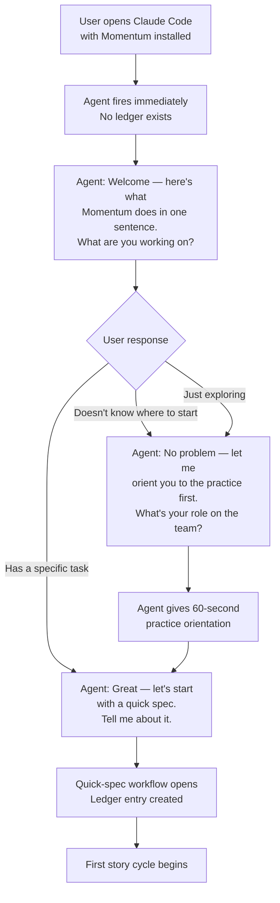
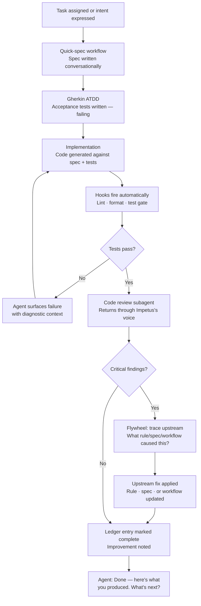
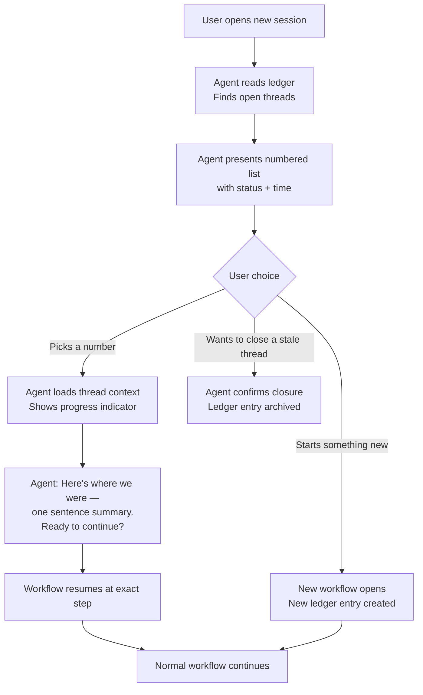

# UX Design Specification: Momentum

**Author:** Steve
**Date:** 2026-03-16

---

<!-- UX design content will be appended sequentially through collaborative workflow steps -->

## Executive Summary

### Project Vision

Momentum is a practice framework for agentic engineering — the missing layer between "use AI tools" and "ship quality software." The framework provides rules, agents, hooks, and workflows that enforce standards; but the primary *interface* to all of this is conversational agents, not documentation. The UX north star: replace "read the docs" with "talk to the agent." Conversation IS the learning; the artifact is the receipt.

The UX is explicitly focused on addressing the **knowledge gap problem** — the experience of new-to-AI developers who don't know what they don't know, and need orientation and guidance more than reference material.

### Target Users

**The New-to-AI Team Member** (primary knowledge gap focus) — part of a small team (4-5 people), brand new or very new to generative AI development. Their core pain is being *lost*: they can't bridge the gap between "here are the docs" and "what do I actually do right now." They are about to create quality debt without realizing it. Their success is defined by never feeling lost — the orchestrating agent knows where they are and tells them what to do next.

**The Solo Builder** — experienced developer with limited time, already using AI tools but hitting the quality wall. Understands the problem; needs a system that compounds. Their UX relationship is about trust and visible improvement over time — the practice getting smarter each sprint.

**The Open-Source Adopter** — secondary; already experiencing the problems, looking for something adaptable to their environment and tooling.

### Key Design Challenges

1. **The Documentation Wall** — Frameworks live or die here. The knowledge gap persona needs the agent to replace documentation entirely, not supplement it. Onboarding must feel like talking to someone who already knows the context.

2. **Invisible Position Problem** — Multi-step workflows (spec → ATDD → implement → review → flywheel) are disorienting without "you are here" signals. Visual progress tracking must feel ambient and constant, not cluttered.

3. **Surfacing Unknown Unknowns** — Users who don't know what they don't know can't ask the right questions. The agent must be proactively calibrated — orienting, not just answering. This is the hardest UX problem in the stack.

4. **Expertise Range Across One Interface** — The solo builder and the new team member have radically different mental models. The same agent, same commands, but the guidance must adapt without requiring visible mode-switching.

5. **Trust in AI-Generated Quality** — The value proposition requires verification to feel natural, not burdensome — and the flywheel must be *visible* so users see improvement accumulating.

6. **Spec Fatigue Under Review Load** — The practice generates review demands (story approvals, architecture decisions, acceptance criteria validation) faster than humans can sustain quality attention. Review quality degrades predictably with time and volume — vigilance decrement onset at 10-15 minutes, decision fatigue across sequential approvals. The practice that produces the specs must also ensure they remain reviewable.

### Design Opportunities

1. **The Orchestrating Agent as Primary UX** — The agent is not a wrapper around docs; it *replaces* docs as the interface. Conversation constitutes learning.

2. **Visual Progress as a Trust Primitive** — Process maps (ASCII or visual) answer "where am I?" with a calm ambient signal. Not cosmetic — the answer to the invisible position problem.

3. **Provenance as Confidence-Building** — The knowledge gap persona gains confidence when they can see *why* something was recommended. Traceability to source builds trust.

4. **Proactive Orientation Without Interruption** — Surface context when an information gap is detected and the conversational floor is open. "I notice you're about to implement without a spec — want me to walk you through quick-spec?" Applied from Nornspun's inner thoughts pattern.

5. **Unified Voice Across Complex Backstage** — Multiple agents (code reviewer, architecture guard, verifier) presenting as one coherent voice. Users work with Momentum, not a team of agents they have to manage.

6. **Attention-Aware Review Design** — Spec fatigue research provides empirically-grounded patterns for sustainable review: tiered checkpoints, motivated disclosure, confidence-directed attention, and expertise-adaptive guidance fading. These transform review from endurance test into directed, purposeful scrutiny.

---

## Core User Experience

### Defining Experience

Momentum's core experience is **orientation on demand** — the moment a user arrives anywhere in the practice with intent, the agent meets them there. They never need to know what to do next; the orchestrating agent tells them. For the knowledge gap persona, the product works when the user's inner monologue shifts from "what am I supposed to do?" to "the agent knows where I am."

The two core loops, by persona:

- **New-to-AI Team Member**: Arrive with a task → agent orients ("here's where your team is, here's what you're working on") → guided workflow executes step by step → artifact produced → agent declares what comes next. The user is never lost.
- **Solo Builder**: Arrive with intent → story cycle (spec → ATDD → implement → review → flywheel) → review finding traces upstream → system improves → next sprint starts smarter. The practice compounds.

The single most critical interaction to get right: **session start orientation**. The first moment of every session must immediately answer "where am I and what do I do?" without the user asking. Everything else follows from that.

### Platform Strategy

Momentum is a **CLI-native, terminal-first** product. The UX surface is entirely text-based:

- **Conversational agent** in the Claude Code chat pane — the primary interface
- **Generated markdown artifacts** — specs, stories, review reports, session documents
- **Terminal output from hooks** — lint, format, test gate results
- **Visual progress indicators** — ASCII/text-based; no web UI, no graphical components

Design constraint: everything must work beautifully within a terminal environment. Visual richness comes from structure, hierarchy, and ASCII art — not color palettes or icons. The CLI *is* the canvas.

### Effortless Interactions

These must require zero deliberate effort — they should simply happen:

1. **Session orientation** — Opening any session immediately shows context: where the project is, what story is active, what phase of the workflow is current. No hunting, no reading docs to remember.
2. **Step handoffs** — When one workflow phase completes, the next begins. The user doesn't need to know the command; the agent tells them what to do.
3. **Hook enforcement** — Lint, format, and test protection fire on save/stop automatically. The user never remembers to run them; they just run.
4. **Proactive gap detection** — The agent notices when a step is about to be skipped and surfaces it: "I notice you're about to implement without a spec — want me to walk you through quick-spec first?"
5. **Post-review flywheel** — When a code review finding occurs, the upstream trace and fix suggestion surface without the user knowing to ask.

### Critical Success Moments

| Moment | Persona | What It Proves |
|--------|---------|----------------|
| **First orientation** | New team member | Agent immediately says "here's where you are, here's your next step" — never felt lost |
| **First automatic hook fire** | Both | System caught something without being asked — enforcement is real |
| **First complete story cycle** | New team member | Went from task → spec → implement → review → done with agent guidance — confidence unlocked |
| **First flywheel cycle** | Solo builder | Code review finding traced upstream, rule updated, system got smarter — practice compounds |
| **First proactive catch** | Both | Agent surfaced a gap before the user made a mistake — the system knows what you don't know |

### Experience Principles

1. **The agent is the interface, not a wrapper around docs** — Conversation replaces documentation as the primary onboarding and guidance mechanism. If a user needs to read a doc to know what to do, the UX has failed.

2. **Always answer "where am I?"** — Every session, every phase transition, every workflow step must maintain the user's sense of position. Visual progress is not cosmetic — it is the answer to the knowledge gap.

3. **Enforcement happens automatically or not at all** — Quality gates, hooks, and checks that require the user to remember to run them will be skipped. Push every enforcement mechanism to the deterministic tier.

4. **One voice, zero machinery visible** — Multiple agents working backstage present as a single coherent Momentum voice. Users direct the practice; they don't manage an agent team.

5. **Surface the unknown unknowns proactively** — The agent detects information gaps and surfaces context before the user makes a mistake, but only when the conversational floor is open. Orient, don't interrupt.

6. **Respect the reviewer's attention budget** — Spec fatigue degrades review quality predictably. Workflows must lead with summaries, offer tiered review depth (quick scan / full review / trust & continue), and never dump full artifacts unprompted. Direct scrutiny where confidence is lowest, not where volume is highest.

---

## Desired Emotional Response

### Primary Emotional Goals

**For the New-to-AI Team Member:** Convert arrival anxiety ("I'm lost, I don't know what to do") into **confidence through orientation** — "I know where I am and I'm doing this correctly." This is the emotional north star for the knowledge gap persona.

**For the Solo Builder:** Replace quiet anxiety about invisible quality debt with **trust** — "the system has my back, and I can see the evidence." The flywheel makes invisible improvement visible, which converts dread into investment.

### Emotional Journey Mapping

| Stage | Arrives feeling... | Should leave feeling... |
|-------|-------------------|------------------------|
| First encounter | Skeptical — "another framework" | Curious — "this is different, it talks to me" |
| Onboarding | Lost, uncertain | Oriented, capable |
| Core workflow | Tentative — "am I doing this right?" | Confident — "the agent confirmed I'm on track" |
| After hook fires automatically | Slightly startled | Relieved and trusting — "it's watching out for me" |
| After complete story cycle | Unsure if it was "correct" | Accomplished — "that was done properly" |
| When flywheel traces upstream fix | Unaware this was possible | Invested — "the system just got smarter" |
| Returning session | Apprehensive — "where was I?" | At home — "the agent knows" |

### Micro-Emotions

- **Confidence vs. Confusion** → the orientation problem — visual progress and proactive context answers this
- **Trust vs. Skepticism** → automation credibility — hooks announce themselves; verification is transparent
- **Accomplishment vs. Frustration** → artifact quality feels earned, not generated
- **Calm vs. Anxiety** → the "did I do that right?" problem — answered by the agent at every step
- **Investment vs. Detachment** → flywheel visibility creates ownership; the user sees the practice improving

### Design Implications

- **Confidence → orientation** — visual progress at every step; session start answers "where am I?" before the user asks
- **Trust → automation transparency** — when a hook fires, it announces itself clearly; when verification runs, it says so
- **Accomplishment → artifact quality** — documents produced feel considered and purposeful
- **Investment → flywheel visibility** — when the system improves itself, the user sees the before/after explicitly
- **Prevent dependency → ownership return** — every workflow completion ends with the agent explicitly returning agency: "Done — this is yours to review and adjust"

### Emotional Design Principles

1. **Orient before the user asks** — answer "where am I?" at every session start and phase transition, unprompted
2. **Make automation visible, not invisible** — when enforcement fires automatically, announce it; invisible quality work doesn't build trust
3. **Return ownership explicitly** — every completion ends with agency returned to the user; the agent is the guide, not the author
4. **Make improvement visible** — the flywheel's work must be surfaced; compounding improvement that the user can't see doesn't create investment
5. **Never manufacture confidence falsely** — bounded acknowledgment of uncertainty builds more trust than false reassurance; the agent admits limits and challenges gaps
6. **Prevent fatigue before the user feels it** — The 39-point perception gap means users cannot self-assess review degradation. Present information in motivated chunks (why this matters, not just what it says), fade guidance as expertise grows (the same orientation every time harms experienced users), and flag confidence levels so reviewers can allocate attention where it matters most.

---

## Spec Fatigue Mitigation Patterns

The following patterns are **authoring guidelines** for skill, agent, and workflow writers. They are grounded in the [spec fatigue research](../../docs/research/spec-fatigue-research-2026-03-21.md) and can be applied immediately without infrastructure changes. Pattern 3 from the research (Multi-Session Dashboard) is parked as a future Impetus product feature requiring UI and orchestration infrastructure; the underlying philosophy is captured in the "Attention as a Finite Resource" principle.

### Attention-Aware Checkpoints

Every workflow checkpoint that pauses for human review should:

- **Lead with a micro-summary** of what was generated and the key decisions made
- **Offer tiered review depth:** quick scan / full review / trust & continue
- **Never dump a full artifact unprompted** — present the summary, let the human pull detail

The goal is not to prevent review but to make review *sustainable*. A reviewer who skims a summary and asks to drill into one section has exercised more genuine scrutiny than one who scrolled past a wall of text and said "looks good."

### Expertise-Adaptive Orientation

Agents and workflows should not deliver the same orientation every time:

- **First encounter:** Full walkthrough with context and worked examples
- **Subsequent encounters:** Abbreviated — decision points and what's changed since last time
- **Expert mode:** Minimal cue, skip directly to the work

The expertise reversal effect (Kalyuga et al., 2003) establishes that instructional techniques effective for novices become actively harmful for experts — experts must reconcile external guidance with their own internal models, increasing cognitive load. Even crude detection is effective: "Full walkthrough or just the decision points?" at workflow start.

### Motivated Disclosure

Every drill-down, detail expansion, or "see more" must be framed with **why it matters**, not just what it contains:

- Not: "Review the architecture document"
- But: "The architecture introduces event sourcing here — different from the CRUD pattern in Stories 1-3. This affects how you'll handle data migration in Story 4.3."

This transforms review from passive chore into motivated retrieval. The coherence cascade principle (Thomas, 2026): progressive disclosure only works when each layer is framed with goal-aligned context that explains why the hidden information is valuable. This is the highest-ROI pattern — zero infrastructure, immediate improvement to every human interaction point.

### Confidence-Directed Review

When generating or presenting specifications, flag sections by confidence level to direct review effort:

- **High confidence** (derived directly from upstream spec): "These 3 acceptance criteria come directly from the epic"
- **Medium confidence** (inferred from patterns or architecture): "Inferred from the architecture — verify it"
- **Low confidence** (no source data): "Needs your input — no source data for this"

This directs scarce review attention where it matters most. Medium verbalized uncertainty consistently produces higher trust, satisfaction, and task performance than either high or low confidence expression (IJHCS, 2025). Aligns naturally with Momentum's provenance infrastructure — `derives_from` chain strength is a natural proxy for confidence level.

---

## UX Pattern Analysis & Inspiration

### Inspiring Products Analysis

**Critical framing:** Momentum is not a standalone tool — it is an enhancement layer *inside* the Claude Code environment where the user already works. The user is already in an agentic IDE workflow with Claude Code and likely BMAD. Momentum improves the quality of that experience. The design surface is not a new interface; it is the quality of conversation, workflow structure, and process guidance within conversations Claude Code already runs.

**What Claude Code determines (outside our design scope):**
- Chat pane rendering and prompt input mechanics
- How tool use and file reads surface in the UI
- Response rendering (markdown in a monospace pane)

**What Momentum controls (our actual design surface):**
- Agent personas, voice, and communication style
- Workflow structures — the shape of back-and-forth dialogue
- Subagent behavior and output format
- Hook output format and announcement style
- ASCII visual progress indicators within agent responses
- Information architecture of every response

**The Gold Standard: BMAD Analyst Workflows**

The BMAD analyst's brainstorming, analysis, and create-brief workflows are the best examples of conversational agentic UX in the space. What works:

- *Treasure hunter communication style* — discovering with the user, not reporting to them. Each synthesis surfaces something the user hadn't fully articulated yet.
- *Genuine dialogue shape* — focused questions, real synthesis, user controls pacing
- *Incremental artifact building* — the document is the receipt of discovery, not a generated report
- *User never fills out a form* — structured workflows feel like thinking together

**Where BMAD Analyst Falls Short (and Momentum must exceed it):**

1. **Progress indication is numerical, impersonal, and value-free** — "Step 3/13" tells the user their position but not their story. It doesn't say what steps 1 and 2 built, what step 3 is about, or what step 4 will deliver. There is no accumulated value visible. The user knows *where* they are but not *why it matters*.

2. **Progress doesn't orient forward or backward** — A well-designed progress indicator answers three questions simultaneously: What have I built so far? What am I doing now and why? What comes next? "3/13" answers none of these.

3. **No subagent orchestration pattern** — BMAD has no concept of continuing dialogue while a subagent works in parallel. When a task takes time, the conversation stops. There is no "while the reviewer is working, let's talk about X" — the productive waiting pattern is entirely absent.

4. **Subagent handoffs are invisible or abrupt** — The unified voice principle is not consistently applied; sometimes the backstage becomes visible in ways that interrupt flow rather than building trust.

### Transferable UX Patterns

**From BMAD Analyst (adopt directly):**
- Step-by-step workflow with genuine back-and-forth at each stage
- User control at every phase transition (A/P/C model)
- Short, focused exchanges rather than long monologues
- Artifact built incrementally through conversation

**From Git (adapt):**
- "Get out of the way" enforcement philosophy — quality gates fire and disappear; they don't demand conversation unless something fails
- State communication that is always available, never intrusive
- Clear, honest output: what was checked, what was found, nothing more

**From AWS/GH CLI (adapt):**
- Progressive disclosure of complexity — new users see simple orientation; experienced users see full options
- Consistent command vocabulary that becomes muscle memory
- Friendly but not performative — warm without being hollow

**From Nornspun's Guided Prep Design (adopt directly):**
- Productive waiting — when a subagent is running, the orchestrating agent keeps the dialogue open with something meaningful
- Progressive context loading — background tasks + foreground conversation, zero dead air
- The process IS the output — conversation constitutes the work, not just precedes it

### Anti-Patterns to Avoid

- **Documentation-as-interface** — if the agent ever says "read this doc" as an answer, the UX has failed
- **Visible agent machinery** — "handing off to the code-reviewer subagent now" breaks unified voice; backstage stays backstage
- **Silent enforcement** — a hook that fires without announcing what it checked builds no trust
- **Numeric position without context** — "3/13" is worse than no progress indicator; it orients without informing
- **Generic encouragement** — "Great work!" is the anti-pattern; every acknowledgment should be substantive
- **Form-filling dialogue** — questions that feel like a checklist rather than genuine elicitation

### Design Inspiration Strategy

**Adopt from BMAD:** The dialogue quality, pacing, and incremental artifact building of the analyst workflows. This is the conversational baseline Momentum must match or exceed.

**Exceed BMAD on:** Progress orientation (narrative, not numeric), subagent orchestration with dialogue continuity, and progress that shows accumulated value — not just position.

**The progress indicator design principle:** Every phase transition must answer three questions: *What have we built together so far? What are we doing now and why does it matter? What comes next?* A number does none of this. A sentence does all three.

---

## Design System Foundation

### Design System Choice

Momentum has no traditional UI framework — Claude Code renders the interface. The equivalent for Momentum is a **conversation design system**: a consistent set of structural patterns that every agent, hook, and workflow follows so the entire experience feels coherent regardless of which agent or step the user is in.

### Rationale for Selection

Momentum is a terminal-native product operating inside Claude Code's chat pane. The design medium is structured text, ASCII hierarchy, and the shape of conversation. Visual consistency comes from response structure and voice, not from component libraries or CSS tokens.

### Implementation Approach

The Momentum conversation design system consists of six pattern types:

**1. Response Architecture Pattern**
Every agent response follows a consistent structure:
- *Orientation line* — where we are, what phase this is (one narrative sentence, never "step N/M")
- *Substantive content* — the actual work of the step
- *Transition signal* — what was accomplished, what comes next
- *User control* — explicit choice before proceeding

**2. Progress Narrative Format**
Every phase transition uses a three-part narrative structure:
```
✓ Built: [what's been established — value accumulated so far]
→ Now:   [what this step does and why it matters]
◦ Next:  [what follows after this]
```

**3. Hook Announcement Template**
Hooks are never silent and never verbose:
```
[hook-name] ✓ checked [what was checked] — [one-line result]
```
On failure: specific issue surfaced immediately, no noise.

**4. Agent Voice Register**
Defined communication style for each agent type:
- *Orchestrating agent*: guide's voice — oriented, substantive, forward-moving
- *Code reviewer*: sharp colleague — specific, evidenced, constructive
- *Architecture guard*: pattern steward — precise, principled, not alarmist

**5. Subagent Orchestration (Hub-and-Spoke) Pattern**
The orchestrating agent (Impetus) is the sole user-facing voice. All subagents work backstage and return to Impetus with structured output. Impetus synthesizes results into his own voice before presenting to the user.

Subagents are designed with **explicit checkpoint contracts**: they pause at decision points and return structured output (`{ status, result, question }`) rather than running to completion blindly. Impetus reads the checkpoint, decides whether to answer it himself, ask the user, or send a directive back via SendMessage. Subagents are resumable by design.

**Engagement continuity principle:** The goal is maintaining the user's thread of attention — not eliminating every pause. Brief pauses are acceptable when context is clear and the user won't disengage. For longer-running tasks, Impetus maintains dialogue on the *same topic* rather than switching subjects — staying in the thread is more engaging than a context switch. For very brief tasks, an acknowledged pause with prior explanation is sufficient. Dead air becomes a problem only when the user loses their sense of where they are or what's happening.

*Open architecture question:* Reliable checkpoint/resume with SendMessage + background agents requires a technical spike to validate before workflows are built on it.

**6. Workflow Transition Template**
At every step boundary: brief synthesis of what was built, clear statement of what's next, explicit user control. Never "continuing..." — always oriented.

### Customization Strategy

Each agent persona can have distinct voice characteristics while sharing the structural patterns above. The structural consistency (progress format, hook templates, transition shape) is non-negotiable; voice register is persona-specific. This allows agents to feel distinct while the overall system feels unified.

---

## Defining Experience

### The Core Interaction

**"Tell the agent where you want to go — it knows how to get you there correctly."**

Not "run this command." Not "read this doc." Not "figure out what step you're on." The user arrives with intent and the agent immediately knows the context, knows the process, and begins guiding. The user's job is to express intent and engage; the agent's job is to orient and drive. The mental model: *Impetus knows what's going on. Tell Impetus what you need.*

### User Mental Model

**Current state (even with Claude Code + BMAD):** The user navigates the tool. They choose the agent, pick the workflow, figure out where they are, decide what comes next. The tool is reactive — it responds to commands.

**With Momentum:** The agent navigates the process for the user. The tool is proactive about orientation. The user expresses intent; the agent converts intent into the right workflow, at the right step, with the right context already loaded. This is the shift from "tool the user operates" to "senior colleague who knows the codebase and the process."

### Success Criteria

- User opens a session mid-story and within two exchanges knows exactly where they are and what to do next — without reading any documentation
- New team member completes their first story cycle guided entirely by the agent — never typed a workflow command they didn't understand
- Solo builder sees the flywheel fire and immediately understands what changed and why, without asking
- User can answer "what phase of the practice are we in right now?" at any point without hesitation

### Novel UX Patterns

The defining interaction is novel: proactive orientation is not how IDE tools currently behave. The interaction medium (conversational text) is entirely familiar; what's novel is the *directionality* — the agent initiates orientation, the user doesn't have to ask for it. Closest metaphors: a Slack bot that knows the project state, a senior dev who always remembers where you left off.

**Teaching implication:** Users trained on reactive tools will wait to be prompted. Onboarding must establish immediately that this agent speaks first.

### Experience Mechanics

| Phase | What happens |
|-------|-------------|
| **Initiation** | User opens session. Agent fires immediately — reads ledger, surfaces active threads, asks one targeted question to confirm intent |
| **Interaction** | Conversational back-and-forth through workflow steps. Agent synthesizes, user confirms or redirects. Progress narrative visible at each transition |
| **Feedback** | ✓ Built / → Now / ◦ Next at every phase boundary. Hooks announce results. Subagents surface through Impetus's voice |
| **Completion** | Agent explicitly hands ownership back: "That's done — here's what was produced. What's next?" Never just stops |

### Multi-Thread Work Model

Momentum must meet users in a fundamentally non-linear, multi-session, multi-tab reality. A user may simultaneously have a story implementation in one Claude Code tab, a UX design workflow in another, research in a third, brainstorming in a fourth. Each tab is an independent agent session. Users stop and start. They context-switch. They return to threads cold after days away.

**The Session Ledger**

The orchestrating agent's first act in any session is to surface the user's current state across *all active threads* — not just the current tab. This requires a persistent ledger (`.claude/momentum/ledger.json`) that every Impetus instance reads and writes.

Each entry contains: thread ID, workflow type, current step, last-active timestamp, and a one-sentence context summary sufficient to re-orient the user instantly.

Session start pattern:
```
You have 3 open threads:
  → Story 4.2 implementation — 2 hours ago, mid-review
  → UX design specification — yesterday, at visual foundation
  → Architecture research — 5 days ago, awaiting your input

Continue one of these, or start something new?
```

The user says "continue the story" and Impetus re-orients immediately. Or "I want to do X" — Impetus opens a new ledger entry and starts fresh, concurrent with the others.

**Multi-Tab Awareness**

Each Claude Code tab is an independent Impetus instance sharing the same ledger. Impetus in tab A sees that tab B has an active story thread. Recently-timestamped entries signal intentional concurrent work and are left undisturbed. Conflicting thread starts (two tabs trying to open the same story) are flagged.

**Thread Hygiene**

Stale threads are cognitive clutter. The orchestrator surfaces dormant threads beyond a threshold and asks about intent — not to delete work, but to keep the ledger honest:

```
"Architecture Research" has been open 3 weeks without activity.
Still relevant, or ready to close it?
```

Hygiene can also be triggered contextually — when dependent work completes, or when the ledger grows unwieldy.

**Design constraint for all workflows:** Every workflow must be resumable from any step, with enough context saved in the ledger entry to re-orient a fresh agent session without the user re-explaining. The ledger entry is the memory that bridges sessions and tabs.

---

## Visual Design Foundation

### Symbol Vocabulary

Consistent symbols carry meaning across every agent and hook — the design tokens of the terminal medium:

```
✓  — completed / confirmed / passing
→  — current / active / in progress
◦  — upcoming / pending / next
!  — warning / attention needed
✗  — failed / blocked
?  — question / decision required
```

Used consistently, these enable instant visual scanning — the user's eye finds state without reading every word.

### Progress Indicator Standard

**The canonical progress format — always exactly 3 lines:**

```
  ✓  Brief · Research · PRD          vision through requirements done
  →  UX Design                       building interaction patterns
  ◦  Architecture · Epics · Stories  3 phases to implementation
```

All completed steps collapse to a single `✓` line with a value summary. The current step stands alone with a one-phrase description of what it's building. Upcoming steps collapse to a single `◦` line. Scales to any workflow length with no ellipsis, counts, or special syntax. The symbol on the first line does all the work.

Applied at: session start, every phase transition, and any time the user may have lost orientation.

### Information Hierarchy

Since color and size are unavailable, hierarchy is expressed through:

- **Bold** — the key signal in any line; user reads bold first, context second
- Markdown headers — section landmarks (`##`, `###`) for document structure
- Code blocks — templates, examples, structured output; visually distinct from prose
- Tables — comparative or multi-attribute data (ledger entries, progress states)
- Blank lines — intentional breathing room; dense responses feel overwhelming

**Information density principle:** Each response has one dominant purpose visible at a glance. The orientation line comes first, the user control comes last, always visible.

### Ledger Display Format

Thread state rendered for quick scanning:

```
  →  Story 4.2 implementation      2h ago   mid-review
  →  UX design specification       1d ago   visual foundation
  ◦  Architecture research         5d ago   awaiting input
```

### Accessibility

Terminal constraints mean color contrast and screen reader support are handled by the host environment. Momentum's responsibility: never rely on symbols alone — always pair symbols with text so meaning survives in any rendering context.

---

## Design Direction Decision

### Key Interaction Moments

**The ledger and the progress indicator are separate instruments for separate moments.** This distinction is foundational to all interaction design in Momentum.

### Moment 1: Session Start — Ledger View (no active workflow)

At session start, no workflow is active. The progress indicator does not appear — it has no context to show. The ledger surfaces what's waiting, nothing more.

```
3 threads in progress:

  1.  Story 4.2 implementation      mid-review          2h ago
  2.  UX design specification       visual foundation   yesterday
  3.  Architecture research         awaiting your input  5d ago

Continue (1/2/3) or tell me what you need?
```

Numbers label entries and serve as instant selection shortcuts. Symbols are absent — every item in the ledger is the same state (incomplete), so no distinction is needed. Status text ("mid-review", "awaiting your input") carries all meaningful context.

### Moment 2: Workflow Resumed — Progress Indicator Appears

Once the user selects a thread, the progress indicator activates for that workflow:

```
  ✓  Discovery · Core Exp · Emotions · Inspiration · Design System · Defining Exp
  →  Visual Foundation             establishing text hierarchy & symbols
  ◦  Design Directions · Journeys · Components · Patterns

  Last time we locked the 3-line progress format. Ready to continue
  into design directions, or anything to revisit first?
```

### Moment 3: Hook Fire — Inline, Orthogonal to Workflows

Hooks fire independently of workflow state. Pass is minimal; failure is diagnostic:

```
  !  post-save: lint failed

     src/ledger.ts:42  'threadId' does not exist on type 'Entry'
     → Entry type likely needs updating after ledger schema change
```

### Design Rationale

- **Symbols carry meaning only where they distinguish states** — ✓/→/◦ inside workflows; absent in the ledger where all items share the same state
- **Numbers in the ledger serve dual purpose** — labeling and selection shorthand
- **Diagnostic context on hook failure** — saves a round-trip; the agent surfaces the likely cause, not just the error
- **Progress indicator activates on workflow entry** — never before, always after

---

## User Journey Flows

### Journey Cross-Reference

| UX Journey | PRD Source |
|---|---|
| Journey 0: First-Time Install | PRD Journey 1 (install flow) |
| Journey 1: First-Time User | PRD Journey 1 (orientation) |
| Journey 2: Story Cycle | PRD Journey 2 |
| Journey 3: Session Resume | No direct PRD journey — addresses FR7/FR41/UX-DR11/UX-DR17 (session ledger persistence and context restore) |
| Journey 4: Version Upgrade | PRD FR3b/FR3c |

---

### Journey 0: First-Time Install

The very first `/momentum` invocation in a new project. No `installed.json` exists — Impetus detects first run, explains what it needs to do, and waits for consent before touching anything.

```
  Momentum 1.0.0 — first time here

  Before we get started, I need to configure a few things for this project:

    · 3 global rules → ~/.claude/rules/
      (authority hierarchy, anti-patterns, model routing)
    · Enforcement hooks → .claude/settings.json
    · MCP servers → .mcp.json

  After setup, you'll need to restart Claude Code once for the
  enforcement hooks to activate. Rules and MCP are available immediately.

  Set up now?
  [Y] Yes · [S] I'll handle it manually
```

After **[Y]** — Impetus executes each action and reports each one:

```
  Setting up Momentum 1.0.0...

  ✓  ~/.claude/rules/authority-hierarchy.md
  ✓  ~/.claude/rules/anti-patterns.md
  ✓  ~/.claude/rules/model-routing.md
  ✓  .claude/settings.json — enforcement hooks configured
  ✓  .mcp.json — Git MCP + Findings MCP configured

  !  Restart Claude Code when ready — hooks activate on restart.
     Rules and MCP are working now.

  What are you working on?
```

After **[S]** — Impetus explains what manual setup requires and proceeds to orientation. Enforcement hooks won't fire until setup is complete, but the agent can still help.

**Design principles:**
- Impetus never installs anything without saying what it's about to do and getting consent
- Each install action is reported individually — no "done" without showing the work
- The `!` restart signal is clear but not blocking; conversation continues immediately
- Setup failure (permission error, file conflict) surfaces with specific diagnosis, not a generic error
- Journey transitions directly to onboarding once setup is confirmed

---

### Journey 4: Version Upgrade

`npx skills update` has already run — the Momentum package on disk is now a newer version. When Impetus starts up, it reads the manifest (new version) and `installed.json` (old version), detects the delta, reads the per-version upgrade instructions, and presents what needs to happen to the user.

The key framing: **Momentum was updated on your machine. Your project hasn't caught up yet. Here's what that means.**

```
  Momentum has been updated to 1.1.0 — your project is configured for 1.0.0.

  Here's what changed and what I need to do:

    · authority-hierarchy.md — revised authority precedence rules
      → update ~/.claude/rules/authority-hierarchy.md

    · mcp-config.json — Findings MCP updated to v2
      → update .mcp.json

  No restart needed for these changes — they take effect immediately.

  Update now, or continue with 1.0.0 for this session?
  [U] Update · [S] Skip for now
```

After **[U]**:

```
  Updating to Momentum 1.1.0...

  ✓  ~/.claude/rules/authority-hierarchy.md updated
  ✓  .mcp.json updated

  Project is now on Momentum 1.1.0.
```

Then immediately transitions to session orientation (ledger display). No lingering on upgrade state.

When hooks config changes (requires restart):

```
  ✓  .claude/settings.json — hooks updated

  !  Restart Claude Code for updated enforcement hooks to activate.
```

**Design principles:**
- The "what changed / what I need to do" pairing is non-negotiable — every upgrade action shows both the reason and the action
- Impetus reads upgrade instructions from the versions manifest; it never guesses what to do
- Skip is always available — 1.0.0 continues to work, just with older rules/config
- Multi-version gaps (skipped updates) apply instructions sequentially: 1.0.0 → 1.1.0 → 1.2.0, each step's changes presented and confirmed
- Upgrade state is never shown again once applied — `installed.json` is updated immediately on success

---

### The `/momentum` Entry Point

`/momentum` is the single command. There is no separate installer, no setup wizard, no second command to remember. Impetus reads `installed.json` at startup and routes:

| State | What Impetus does |
|-------|------------------|
| No `installed.json` | Journey 0 — first-time install |
| `installed.json` version < manifest version | Journey 4 — version upgrade |
| Versions match | Normal session start — ledger display |

The user never decides which of these applies. Impetus determines context and acts accordingly.

---

### Journey 1: First-Time User (Onboarding)

The knowledge gap persona's first session after install is complete. Agent speaks first — user doesn't need to know any commands.



### Journey 2: The Story Cycle (Core Loop)

The repeating engine of the practice. Every story goes through this arc.



### Journey 3: Session Resume (Returning User)

The ledger in action. Zero re-explanation required.



### Journey Patterns

- **Agent always speaks first** — no journey starts with the user needing to know a command
- **One question at a time** — the agent never presents more than one decision at a step
- **Explicit completion signal** — every journey has a clear "done" moment with ownership returned to the user
- **Graceful re-entry** — any journey can be paused and resumed with full context restored from the ledger

### Flow Optimization Principles

- **Steps to first value are minimized** — onboarding bypasses orientation for users who arrive with a task
- **Error surfaces with diagnosis** — failures include likely cause, not just the error message
- **Stale thread hygiene is low-friction** — closing a thread is one confirmation, not a ceremony
- **Flywheel is always visible** — when upstream fixes are applied, the improvement is named explicitly

---

## Component Strategy

### Design System Components

Momentum has no UI framework. The "components" are **conversation primitives** — structural patterns agents compose to build every interaction. There are nine, derived from the user journeys.

### Custom Components

**1. Session Ledger Display**
*Appears at:* every session start with open threads

```
3 threads in progress:

  1.  Story 4.2 implementation      mid-review          2h ago
  2.  UX design specification       visual foundation   yesterday
  3.  Architecture research         awaiting your input  5d ago

Continue (1/2/3) or tell me what you need?
```
States: single thread, multiple threads, empty (first-time user — component not shown)

---

**2. Progress Indicator**
*Appears at:* workflow entry and every phase transition

```
  ✓  Brief · Research · PRD          vision through requirements done
  →  UX Design                       building interaction patterns
  ◦  Architecture · Epics · Stories  3 phases to implementation
```
States: near start (few ✓), mid-workflow, near end (few ◦)

---

**3. Workflow Step**
*Appears at:* every step in every workflow — the most frequent pattern

```
[one-sentence orientation — where we are and why it matters]

[substantive content of the step]

[A] Advanced Elicitation
[P] Party Mode
[C] Continue
```
States: first step (no prior context), mid-workflow, final step

---

**4. Hook Announcement**
*Appears at:* every hook fire, automatically

Pass: `  ✓  post-save   lint passed · format applied`

Fail:
```
  !  post-save: lint failed

     src/ledger.ts:42  'threadId' does not exist on type 'Entry'
     → Entry type likely needs updating after ledger schema change
```
States: pass (minimal), fail (with diagnostic context)

---

**5. Subagent Return**
*Appears at:* whenever a subagent completes and Impetus surfaces the result in his own voice

```
  The code review found 2 items worth your attention:

  !  [critical] Missing null check — ledger.getThread() can return
     undefined when threadId doesn't exist (src/ledger.ts:67)

  ·  [minor] Inconsistent naming — 'threadID' vs 'threadId' across 3 files

  The critical finding traces upstream. Want to fix that now?
```
States: clean pass, minor only, critical findings, flywheel trigger

---

**6. Completion Signal**
*Appears at:* end of every story cycle, end of every workflow

```
  ✓  Story 4.2 complete — session ledger implementation done

  What was produced:
    · src/ledger.ts — LedgerEntry type + CRUD operations
    · src/ledger.test.ts — 12 passing acceptance tests
    · .claude/rules/ledger-patterns.md — upstream fix from code review

  This is yours to review and adjust. What's next?
```
Constraint: always returns ownership explicitly — "this is yours"

---

**7. Flywheel Notice**
*Appears at:* whenever an upstream fix is applied after a code review finding

```
  ↑  Flywheel: upstream fix applied

     Finding:   null check missing on ledger.getThread()
     Root cause: Entry type allowed undefined threadId
     Fix:        Added threadId as required field in Entry type
     Prevents:   This class of null-reference error in future ledger code

  The practice just got smarter.
```

---

**8. Proactive Orientation**
*Appears at:* when agent detects a knowledge gap or about-to-be-skipped step

```
  ?  I notice you're about to implement without an accepted spec.
     The authority hierarchy means tests and code derive from the spec —
     implementing first creates risk.

     Want to run quick-spec first? Takes about 5 minutes.
     Or proceed anyway — your call.
```
Constraint: offer, never block. Decision always returned to the user.

---

**9. Install/Upgrade Status**
*Appears at:* first-time install and version upgrade — each action reported individually

First-run install:
```
  Setting up Momentum 1.0.0...

  ✓  ~/.claude/rules/authority-hierarchy.md
  ✓  ~/.claude/rules/anti-patterns.md
  ✓  ~/.claude/rules/model-routing.md
  ✓  .claude/settings.json — enforcement hooks configured
  ✓  .mcp.json — MCP servers configured

  !  Restart Claude Code for enforcement hooks to activate.
```

Version upgrade:
```
  Updating to Momentum 1.1.0...

  ✓  ~/.claude/rules/authority-hierarchy.md updated
  ✓  .mcp.json updated

  !  No restart needed.
```

States: first-run (all components listed), upgrade (changed components only), restart-required variant, no-restart variant, partial-failure (specific failed action surfaced with diagnosis).

---

### Component Implementation Strategy

Components are implemented as agent instruction patterns — structured prose in workflow and agent files that consistently produce these output shapes. Not code components; behavioural contracts enforced through agent design.

### Implementation Roadmap

| Phase | Components | Rationale |
|-------|-----------|-----------|
| Day 1 | Install/Upgrade Status, Progress Indicator, Hook Announcement, Session Ledger | Setup must work before anything else; orientation and enforcement follow |
| Sprint 1 | Workflow Step, Completion Signal | Story cycle can't run without them |
| Sprint 2 | Subagent Return, Flywheel Notice, Proactive Orientation | Quality layer and compounding improvement |

---

## UX Consistency Patterns

Eight recurring conversational situations that must be handled consistently across every workflow and agent.

### Input Interpretation

Users express intent in multiple ways — the agent handles all gracefully:

| Input type | Example | Agent behaviour |
|-----------|---------|----------------|
| Number | `2` | Select ledger item 2, no confirmation needed |
| Letter command | `C` or `c` | Continue — case-insensitive, always works |
| Fuzzy match | `continue`, `yes`, `go ahead` | Treated as C |
| Natural language | `let's do the story` | Extract intent, confirm: "Starting Story 4.2 — correct?" |
| Ambiguous | `that one` | Ask: "Which one — the story (1) or the architecture research (3)?" |
| Off-topic question | `wait, what's the authority hierarchy?` | Answer, then return to active step |

### Uncertainty Recovery

When the agent isn't sure what the user means — never guess silently. One clarifying question, never two:

```
  ?  I want to make sure I understand — are you asking me to:

     1. Continue the current step
     2. Skip to the next workflow phase
     3. Something else

  Which fits?
```

### Step Re-entry After Interruption

When a workflow step was interrupted — never silently re-runs, always confirms first:

```
  You were mid-way through Visual Foundation when we stopped.
  [one-sentence summary of last discussion]

  Continue from here, or restart this step?
```

### Long-Running Task

Engagement continuity — topic stays relevant, no context switch:

```
  The code reviewer is working through Story 4.2.

  While that runs — the null-check pattern we flagged earlier:
  fix it in this story or track as a separate tech-debt item?
```

### Graceful Pause / Exit

Ledger entry updated immediately — no data loss on any exit:

```
  Pausing UX Design at Visual Foundation.
  Saved to ledger — pick up any time.
```

### Conflicting Thread Warning

Warns, never blocks — user decides:

```
  !  This thread appears active in another tab (4 minutes ago).
     Opening here may cause conflicts. Proceed anyway?
```

### Stale Context / Missing Information

Never fabricates — surfaces the gap explicitly:

```
  ?  I don't have enough context about the ledger schema here.

  1. Make a reasonable assumption and flag it
  2. Ask you a couple of questions first

  Which would you prefer?
```

### Proactive Intervention Threshold

- **Floor open** (user just sent C, finished a step) → surface immediately
- **Floor not open** (user mid-thought) → queue for next natural pause
- **Critical** (about to violate authority hierarchy) → always surfaces regardless

```
  ?  Before we proceed — [issue]. Worth pausing on this?
     Yes / No, proceed anyway
```

---

## Environment Adaptation & Cognitive Accessibility

### Terminal Width Variation

Claude Code renders in panes of varying width. Every component must be readable without horizontal scrolling at ~80 characters. The Progress Indicator and Ledger Display are designed for inline format; this is the clean fallback at narrow widths:

```
  ✓  Brief · Research · PRD
     vision through requirements done
  →  UX Design
     building interaction patterns
  ◦  Architecture · Epics · Stories
     3 phases to implementation
```

### Rendering Environment Resilience

The symbol vocabulary (✓ → ◦ ! ✗ ?) uses widely-supported Unicode that renders in VS Code, standard terminals, and Claude Code. The symbol-plus-text rule makes all components resilient: adjacent text carries full meaning if symbols don't render.

### Cognitive Accessibility — The Knowledge Gap Standard

The most important accessibility consideration for Momentum is cognitive — specifically for the new-to-AI persona. Every agent output must meet this standard:

- **Plain language first** — no jargon without inline explanation on first use ("authority hierarchy (spec > tests > code)" not just "authority hierarchy")
- **One thing at a time** — single question per exchange, single decision per step
- **No assumed knowledge** — the agent explains *why* before asking *what*
- **Graceful correction** — when the user does something out of sequence, the agent explains the correct sequence and why, not just that they're wrong
- **Progressive complexity** — first encounters with any concept are simplified; detail layers in with experience

### Testing Considerations

- Components tested at 80-char and 120-char width — both must be clean
- Symbol rendering disabled — verify text carries full meaning without Unicode
- Session resume with cold context — verify one-sentence summary re-orients without re-reading prior conversation
- New user test (knowledge gap persona) — if they hesitate or ask "what do I do?", the UX has failed
