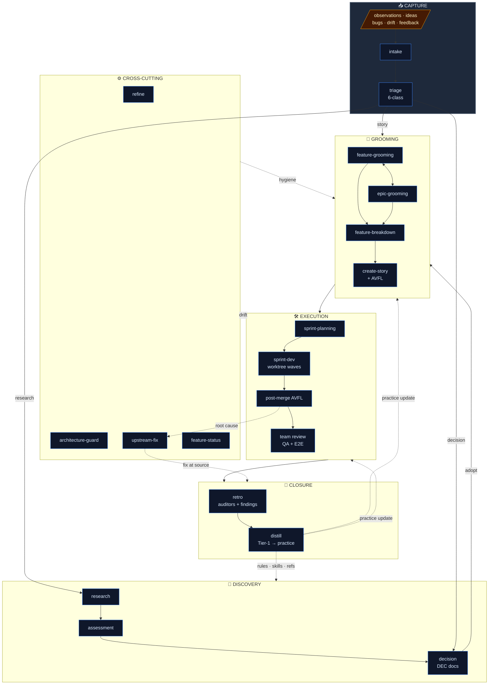

# Momentum Workflow

End-to-end view of how work flows through Momentum: from raw signal (research, observations, drift) all the way through grooming, sprint execution, and retro feedback into the practice itself.

> **Status:** Draft v0.1 — expect iteration. Use this doc as the canonical picture; update both the Mermaid diagram and the ASCII fallback when phases shift.

## Phases at a glance

| Phase | Purpose | Primary skills |
|---|---|---|
| **Discovery** | Generate strategic context | `research`, `assessment`, `decision` |
| **Capture** | Convert signal into structured backlog | `intake`, `triage` |
| **Grooming** | Shape backlog into shippable units | `feature-grooming`, `epic-grooming`, `feature-breakdown`, `create-story` |
| **Execution** | Build and merge stories | `sprint-planning`, `sprint-dev`, `dev`, `avfl` |
| **Closure** | Learn and improve the practice | `retro`, `distill` |
| **Cross-cutting** | Hygiene + drift control | `refine`, `architecture-guard`, `upstream-fix`, `feature-status` |

## Mermaid diagram



## ASCII fallback

```
                          MOMENTUM WORKFLOW
                          ═════════════════

  ┌─────────────────────── DISCOVERY ───────────────────────┐
  │                                                          │
  │   ┌──────────┐      ┌────────────┐      ┌────────────┐  │
  │   │ Research │─────▶│ Assessment │─────▶│ Decisions  │  │
  │   │          │      │            │      │ (DEC docs) │  │
  │   └──────────┘      └────────────┘      └─────┬──────┘  │
  │        ▲                                       │         │
  └────────┼───────────────────────────────────────┼─────────┘
           │                                       │
           │ (open questions)                      │ (adopt)
           │                                       ▼
  ┌────────┴──────────────── CAPTURE ───────────────────────┐
  │                                                          │
  │   observations, ideas, bugs, drift, feedback             │
  │                          │                               │
  │                          ▼                               │
  │                   ┌─────────────┐                        │
  │                   │   Intake    │  (stub → backlog)      │
  │                   └──────┬──────┘                        │
  │                          │                               │
  │                          ▼                               │
  │                   ┌─────────────┐                        │
  │                   │   Triage    │  (classify 6 ways)     │
  │                   └──────┬──────┘                        │
  │           ┌──────────────┼──────────────┐                │
  │           ▼              ▼              ▼                │
  │       [decision]     [research]     [story]              │
  │           │              │              │                │
  └───────────┼──────────────┼──────────────┼────────────────┘
              │              │              │
              └──────────────┘              │
                                            ▼
  ┌────────────────────── GROOMING ─────────────────────────┐
  │                                                          │
  │   ┌──────────────────┐         ┌──────────────────┐     │
  │   │ Feature Grooming │◀───────▶│  Epic Grooming   │     │
  │   │ (taxonomy/value) │         │ (story breakdown)│     │
  │   └────────┬─────────┘         └────────┬─────────┘     │
  │            │                            │                │
  │            └──────────────┬─────────────┘                │
  │                           ▼                              │
  │                  ┌─────────────────┐                     │
  │                  │  Create Story   │  (specs + AVFL)     │
  │                  └────────┬────────┘                     │
  │                           │                              │
  └───────────────────────────┼──────────────────────────────┘
                              │
                              ▼
  ┌────────────────────── EXECUTION ────────────────────────┐
  │                                                          │
  │   ┌──────────────────┐                                   │
  │   │ Sprint Planning  │ (select stories, Gherkin, team)   │
  │   └────────┬─────────┘                                   │
  │            ▼                                              │
  │   ┌──────────────────┐    ┌──────────┐    ┌──────────┐  │
  │   │   Sprint Dev     │───▶│ Post-AVFL│───▶│   Team   │  │
  │   │ (worktree waves) │    │  (fix)   │    │  Review  │  │
  │   └──────────────────┘    └──────────┘    └─────┬────┘  │
  │                                                  │       │
  │                                                  ▼       │
  │                                          ┌──────────────┐│
  │                                          │  Retro       ││
  │                                          │ (auditors,   ││
  │                                          │  findings)   ││
  │                                          └──────┬───────┘│
  └─────────────────────────────────────────────────┼────────┘
                                                    │
                          ┌─────────────────────────┘
                          │ (Tier-1 findings)
                          ▼
                  ┌───────────────┐
                  │    Distill    │──▶ rules / skills / refs
                  └───────┬───────┘     (practice update)
                          │
                          └─────────▶ feeds back into ALL phases
                                      (better next time)

  ─────────────────────────────────────────────────────────
   Cross-cutting: Refine (backlog hygiene) · Architecture
   Guard (drift detection) · Upstream-Fix (root-cause traces)
  ─────────────────────────────────────────────────────────
```

## Notes for iteration

- **Quick-fix path** is not shown — it's a sidecar that bypasses sprint planning for single-story changes (`intake → quick-fix → merge`). Worth adding when we agree on placement.
- **Impetus** is the orchestrator that fronts most of these — show it as a top-level entry point or keep it implicit?
- **Cross-cutting** lane is gestural; if any of those skills become first-class phase participants, promote them.
- Feedback arrows from `distill` are dotted to convey "asynchronous practice update" vs the solid "work flows here next" arrows.
